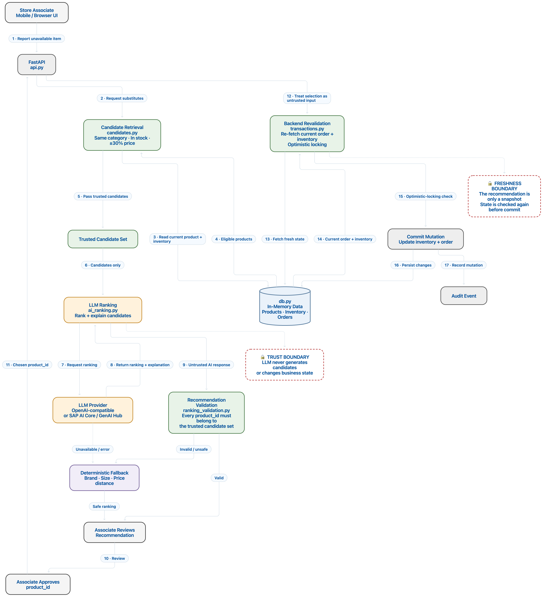

# BOPIS Store Associate Assistant

A vertical slice of the substitution-recommendation exception flow from the design doc's §13: an associate reports an item unavailable, a trusted candidate set is retrieved and hard-filtered deterministically, an LLM ranks and explains that set, the ranking is validated before the associate ever sees it, and only a re-validated, associate-approved acceptance is allowed to touch inventory or order state.

The prototype also includes deterministic nearby-store inventory discovery and shelf-issue reporting as supporting exception capabilities.

## Architecture



**The LLM ranks and explains a trusted, deterministically filtered candidate set — it never generates candidates, and it never touches inventory or order state.**

The core flow is:

**Retrieve → Filter → Rank → Validate → Approve → Revalidate → Commit**

`candidates.py` builds the only universe a recommendation may reference: same category, in stock at the current store, within a ±30% price band. It also accepts an explicit `customer_allergies` filter — see "Deliberate scope exclusions" below for why this parameter exists but isn't wired to a real data source yet. `ai_ranking.py` asks the model to order and justify that set. `ranking_validation.py` checks every `product_id` in the model's response against the trusted set before anything reaches the UI, discarding the whole response for a deterministic fallback ranking on any single failure. `transactions.py` then re-fetches order and inventory state from scratch and commits with an optimistic-locking check.

This boundary exists for two independent reasons: model output is **untrusted**, and the world is **stale by the time it matters**. The model can hallucinate a product or become temporarily unavailable, while inventory can change between recommendation time and acceptance time. A recommendation answers "what looks like a good substitute"; only a fresh backend check answers "is this still valid right now?"

Every step after LLM ranking is deterministic Python. If the LLM is unavailable or produces malformed or unsafe output, the associate receives a deterministic fallback ranking based on trusted product data. AI failure therefore degrades recommendation quality, not the core picking workflow.

The backend is intentionally implemented as a **modular monolith** for the prototype. The module boundaries mirror the service boundaries that could be extracted in production:

````text
Associate Mobile / Web UI
          │
          ▼
      FastAPI API
          │
    ┌─────┴──────────────────────────┐
    │                                │
    ▼                                ▼
Order / Inventory / Catalog     AI Orchestration
    │                                │
    ▼                                ▼
Candidate Retrieval              LLM / Model
    │                                │
    └──────────────┬─────────────────┘
                   ▼
            Output Validation
                   │
                   ▼
           Associate Approval
                   │
                   ▼
          Backend Revalidation
                   │
                   ▼
              Transaction
                   │
                   ▼
              Audit Event
````

For production, these modules could evolve into independently scalable services behind an API/BFF, with event-driven notification, analytics, replenishment, and persistent transactional storage.

## AI trust boundary

The system deliberately separates **recommendation** from **authority**.

| Layer                       | Responsibility                        | Trust         |
| ---------------------------- | -------------------------------------- | ------------- |
| Catalog / Inventory / Order | Authoritative facts                   | Trusted       |
| Candidate retrieval         | Defines valid recommendation universe | Trusted       |
| Deterministic filters       | Enforces business constraints         | Trusted       |
| LLM                          | Ranking + explanation only            | Untrusted     |
| Output validation           | Rejects unsafe model output           | Trusted       |
| Associate                    | Human approval                        | Required      |
| Transaction layer            | Final state mutation                  | Authoritative |

An accepted recommendation is treated as nothing more than **an associate-selected `product_id`**. The transaction layer does not give an accepted product additional trust merely because it originated from the AI path.

## Main substitution flow

For an unavailable item:

1. Retrieve candidate products from trusted catalog and inventory data.
2. Apply deterministic hard filters:

   * same product category
   * available inventory at the current store
   * price within ±30% of the original
3. Send only the trusted candidates to the LLM.
4. Validate every model recommendation against the original candidate set.
5. Fall back to deterministic ranking if the LLM is unavailable or its output is invalid.
6. Present the validated ranking to the associate.
7. Associate explicitly accepts one product.
8. Re-fetch current order and inventory state.
9. Check inventory version using optimistic locking.
10. Decrement inventory and update the order item.
11. Record an audit event.

The order item's status becomes `PICKED` either way; `substituted_product_id` records the accepted SKU whenever it differs from the item's originally requested product. (`OrderItemStatus.SUBSTITUTED` exists in the schema, but `transactions.py` doesn't currently assign it — a substitution is represented as "`PICKED`, with a `substituted_product_id` that differs from the original," not as a distinct status value.)

## Deterministic fallback

The LLM is optional infrastructure, not a critical path.

When no LLM provider is configured, `api.py` catches the ranking failure and uses `ranking_validation.py`'s deterministic fallback. The fallback prefers:

1. same brand
2. smaller size difference
3. smaller price difference
4. stable product ordering

This makes the prototype fully runnable without external AI credentials while preserving the same safety boundary.

## Nearby-store discovery

The prototype also implements a deterministic nearby-store inventory lookup:

````text
availability × (1 / distance_km) × inventory_confidence
````

The endpoint considers only trusted inventory and store metadata. It excludes the current store and zero-stock stores and returns deterministic results.

This is intentionally separate from LLM substitution ranking: nearby-store fulfillment is a different optimization problem and does not require generative reasoning. It's also currently a separate tool from the substitution flow rather than a third option alongside it — see "If I had one more week" below.

## Shelf-issue reporting

Associates can report:

* `empty`
* `low`
* `damaged`
* `misplaced`

A shelf report creates an audit event but does **not** directly modify inventory. In production, these events could feed replenishment, anomaly detection, and demand/availability forecasting.

## How to run

This prototype was developed and verified against **Python 3.12**; 3.13 should work identically. If you enable the optional SAP AI Core / GenAI Hub provider, its `ai-core-sdk` dependency uses native (PyO3) extensions, which can occasionally lag behind on prebuilt wheels for very new Python releases — if `pip install` fails specifically on that optional dependency, try a slightly older Python (3.12–3.13) or build it from source per SAP's own instructions.

````bash
python3 -m venv .venv
source .venv/bin/activate

python -m pip install --upgrade pip
pip install -r requirements.txt -r tests/requirements-test.txt
````

Start the application:

````bash
uvicorn backend.api:app --reload
````

Open:

````text
http://localhost:8000/
````

`api.py` serves `frontend/index.html` directly, so no separate frontend server or build step is required.

## LLM configuration

**No `.env` file or real LLM credentials are required to run the prototype.**

Without an LLM provider configured, the application falls back to deterministic ranking as described above.

To exercise a real OpenAI-compatible provider:

````bash
export OPENAI_API_KEY=sk-...
export LLM_MODEL=gpt-4o-mini

# Optional for another OpenAI-compatible endpoint:
# export OPENAI_BASE_URL=...
````

Alternatively, use SAP AI Core / GenAI Hub:

````bash
export AICORE_CLIENT_ID=...
export AICORE_CLIENT_SECRET=...
export AICORE_AUTH_URL=...
export AICORE_BASE_URL=...
export AICORE_RESOURCE_GROUP=...
export LLM_MODEL=...
````

The SAP configuration is consumed by `llm_client.py`, which constructs the GenAI Hub client when the AI Core environment is configured and otherwise supports an OpenAI-compatible provider.

The LLM client also applies a bounded timeout and retries transient connection/server failures once. Non-transient configuration or malformed-response errors are not blindly retried.

## Automated tests

The backend has a comprehensive unit and integration test suite:

````text
295 tests
98% statement coverage
0 failing tests
````

Run the complete suite from the repository root:

````bash
pytest
````

Run with coverage:

````bash
pytest --cov=backend --cov-report=term-missing
````

Run an individual module:

````bash
pytest tests/test_db.py -v
````

Run tests by keyword:

````bash
pytest -k "fallback"
````

### Test coverage

````text
backend/ai_ranking.py         100%
backend/api.py                100%
backend/candidates.py         100%
backend/db.py                 100%
backend/llm_client.py          84%
backend/models.py             100%
backend/ranking_validation.py 100%
backend/transactions.py       100%

TOTAL                          98%
````

The suite covers:

* Pydantic domain models and resolved-item states
* in-memory database initialization and state changes
* deterministic substitution candidate filtering, including price-band boundaries and the allergen filter's documented no-op-when-`None` behavior
* LLM provider configuration and retry/error classification
* structured LLM response parsing, including malformed and fenced JSON responses
* hallucinated product IDs, and that a single bad entry discards the *entire* AI response, not just that entry
* ranking validation and deterministic fallback (brand/size/price ordering, unit normalization)
* idempotent substitution acceptance
* optimistic inventory locking and concurrent conflicts
* `PICKED` status transitions, including `substituted_product_id` tracking when the accepted SKU differs from the original
* order completion gates
* zero-candidate item resolution through `UNAVAILABLE`
* every HTTP API route through FastAPI `TestClient`
* nearby-store inventory scoring
* shelf-issue validation and audit behavior
* full end-to-end substitution and completion flows for both seeded orders

### Test philosophy

The tests deliberately use the **real shipped seed data** rather than maintaining a separate hand-written test dataset. The `fresh_db` fixture copies the actual `data/*.json` files into a temporary directory before each test and initializes the database from that copy.

The API tests use the real FastAPI application and lifespan, exercising the actual:

````text
candidates.py
      ↓
ai_ranking.py
      ↓
ranking_validation.py
      ↓
transactions.py
````

pipeline.

The only mocked boundaries are the external LLM calls (`ai_ranking.rank_candidates` and `llm_client.call_structured`). This keeps the suite deterministic and prevents accidental network access while still testing the trust boundary itself — a mocked hallucinated `product_id` still passes through the real `ranking_validation.py` and is rejected exactly as it would be from a real, misbehaving model.

Two complete end-to-end order flows are covered:

* **ORD-1002** — every item has a valid substitute and the order reaches `READY`.
* **ORD-1001** — the banana item has no valid substitute, `/complete` correctly refuses the order, the item is explicitly resolved as `UNAVAILABLE`, and the order then reaches `READY`.

The remaining ~16% coverage gap in `llm_client.py` is the SAP AI Core / GenAI Hub client-construction success path. That path depends on the optional `ai-core-sdk` / `generative-ai-hub-sdk` packages, which aren't installed by `tests/requirements-test.txt` — the module's own source already marks the adjacent import-failure branch `# pragma: no cover` for the same reason. This is a documented, environment-gated gap, not an oversight; see item 6 under "If I had one more week" below.

## Manual API smoke test

`smoke_test.py` is the preferred way to exercise the complete workflow against a running server:

````bash
python smoke_test.py
````

It verifies the real substitution pipeline, including recommendation retrieval, validation, acceptance, transaction commit, the completion gate, and the final `READY` transition. It also demonstrates the zero-candidate path for ORD-1001 by explicitly resolving the item as unavailable before completing the order.

For reference, the API sequence is:

### 1. Inspect an order

````bash
curl -s http://localhost:8000/orders/ORD-1001 | python3 -m json.tool
````

### 2. Report an item unavailable

````bash
curl -s -X POST \
  http://localhost:8000/orders/ORD-1001/items/ITEM-1001-1/unavailable \
  | python3 -m json.tool
````

The response contains the validated recommendation set. The `product_id` for the acceptance step should come from this response rather than being hard-coded.

### 3. Accept a recommendation

````bash
curl -s -X POST \
  http://localhost:8000/orders/ORD-1001/items/ITEM-1001-1/substitution \
  -H "Content-Type: application/json" \
  -d "{\"product_id\": \"PRODUCT_ID\", \"idempotency_key\": \"$(uuidgen)\"}"
````

### 4. Inspect the resulting order

````bash
curl -s http://localhost:8000/orders/ORD-1001 | python3 -m json.tool
````

The item's status will be `PICKED`, with `substituted_product_id` set to the accepted SKU whenever it differs from the originally requested product.

### 5. Attempt completion

````bash
curl -s -X POST \
  http://localhost:8000/orders/ORD-1001/complete
````

After resolving only the first item, this correctly returns `400` because other items remain unresolved. This is the FR-7 completion gate working as intended.

`smoke_test.py` is preferable to manually completing the entire curl sequence because it obtains recommendation IDs dynamically and uses fresh idempotency keys.

## API surface

### Core order flow

````text
GET  /orders/{order_id}
POST /orders/{order_id}/items/{item_id}/unavailable
POST /orders/{order_id}/items/{item_id}/substitution
POST /orders/{order_id}/items/{item_id}/resolve-unavailable
POST /orders/{order_id}/complete
````

### Inventory / store tools

````text
GET  /inventory/nearby?product_id={product_id}&store_id={store_id}
POST /inventory/{store_id}/{product_id}/shelf-report
````

### Catalog / directory

````text
GET /orders?store_id&status
GET /products
GET /stores
GET /audit-events?event_type
````

### Operational

````text
GET /health
GET /
````

The prototype deliberately implements only the API surface needed for the vertical slice rather than the complete production API described in the design document.

## Deliberate scope exclusions

This is the "one vertical slice" build requested by the design doc's §13, not a full implementation of the production architecture.

Explicitly out of scope:

* **No persistent database** — `db.py` is in-memory and seeded from JSON files at startup. A restart resets state.
* **No authentication/authorization** — no real associate identity exists; audit events use `"associate_id": "prototype"` as an explicit placeholder.
* **No offline synchronization** — the design doc's §7.4 local queue/sync model is not implemented.
* **No real customer allergy data source** — `candidates.py` accepts and hard-filters on an explicit `customer_allergies` parameter, but no endpoint in this prototype currently supplies real customer-allergy data, so the parameter defaults to `None` (a documented no-op) on every call the API makes today. The filter is implemented and tested; it just isn't wired to anything upstream yet.
* **No production reservation system** — `Inventory.reserved_quantity` exists for schema fidelity but is not used. The prototype decrements `quantity` at acceptance time.
* **No production-grade distributed transaction infrastructure** — `transactions.py` provides idempotency and optimistic locking within the in-memory prototype, but it cannot provide real database crash atomicity across multiple persistent writes.
* **No production store-fulfillment orchestration** — nearby-store discovery is implemented as a deterministic prototype capability, but real store routing, inventory federation, reservation transfer, and fulfillment coordination are out of scope.
* **No replenishment/forecasting engine** — shelf reports are captured as auditable events; production forecasting and replenishment are future consumers of that data.

These are deliberate boundaries rather than silently missing functionality.

## If I had one more week

Prioritized by risk and value, not by effort:

1. **Real transactional storage.** Replace `db.py`'s in-memory dicts with Postgres (or SQLite for a lighter lift), and replace the independently-locked mutation sequence in `transactions.py` with one real `BEGIN...COMMIT` around the decrement + item-status update — closing the exact gap `transactions.py`'s own docstring already names as unrepairable today.
2. **Wire customer allergy data end-to-end.** The hard filter already exists and is tested; it just has no real data source. Adding a minimal `Customer` record and threading it through `api.py` turns this from "supported but inert" into a real safety feature — probably the single highest-value gap, since it's a food-safety concern rather than a UX one.
3. **Real reservation at order-assignment time.** `Inventory.reserved_quantity` is unused today; stock is only decremented at accept-time, so two associates can both be shown a substitute only one of them can actually get. Reserving at order-assignment (or at minimum at recommendation time with a short TTL) closes that race for real, instead of just detecting it after the fact via optimistic locking.
4. **Auth and per-associate identity.** Every audit event currently says `"associate_id": "prototype"`. Even a lightweight session/JWT layer would make the audit log — and idempotency keys, which are currently trusted at face value — meaningfully attributable.
5. **Fold nearby-store fulfillment into the exception flow.** Today nearby-store lookup and substitution are two separate tools; an associate facing a zero-candidate item (the banana case) has no way to route the customer to another store without leaving the flow. Surfacing nearby-store results as a third option alongside "substitute" / "remove" on the same screen closes a real UX gap the demo scenario exposes.
6. **Close the SAP AI Core coverage gap for real**, by installing `ai-core-sdk` / `generative-ai-hub-sdk` in CI and adding the same-shaped success-path test the "Automated tests" section above already flags as missing. Right now that branch runs in production but isn't exercised in tests, which is backwards.
7. **CI pipeline**: run `pytest --cov` on every PR with a coverage floor (e.g. fail under 95%), plus lint/type-check (`ruff`, `mypy`) — several modules already use precise `from __future__ import annotations` typing that would benefit from being enforced, not just aspirational.
8. **Structured logging and basic tracing**, especially around the one place a real bug would be expensive to debug blind: the gap between `decrement_inventory` succeeding and `update_order_item_status` failing, which `transactions.py` already raises loudly for but currently only to stdout.
9. **Offline queue / sync** per the design doc's §7.4 — lowest priority on this list only because it's the largest single lift, not because it matters least; a store associate's connectivity is exactly where this system is most likely to be needed under pressure.

Given only a week, I'd stop after (1)–(4): those are the cases where "prototype" behavior is currently indistinguishable from "silently wrong" behavior under real concurrent load, which is a different risk category from "feature not built yet."

## Demo scenario

The seed data in `data/` provides two complete scenarios.

### ORD-1001 — exception-heavy order

Assigned to `STORE-1`, with four items.

The primary example is:

**Coca-Cola Zero 1.5L ×2**

The requested SKU has zero available units at STORE-1. Its same-category, in-stock, in-price-band candidates provide a real recommendation set for the AI/fallback ranker.

The pipeline is:

````text
Coca-Cola Zero unavailable
        ↓
Retrieve trusted soda candidates
        ↓
Apply stock + price filters
        ↓
LLM / deterministic ranking
        ↓
Validate product IDs and scores
        ↓
Associate approval
        ↓
Fresh inventory revalidation
        ↓
Optimistic-locking commit
        ↓
PICKED (substituted_product_id set)
````

The spaghetti and whole-milk items also have valid candidate sets.

The banana item deliberately has no valid same-category substitute within the ±30% price band. Therefore candidate retrieval returns an empty list. The associate can explicitly resolve it through:

````text
POST /orders/{order_id}/items/{item_id}/resolve-unavailable
````

with:

````json
{
  "resolution": "REMOVE"
}
````

The item becomes `UNAVAILABLE`, allowing the order to reach `READY` once all other items are resolved.

### ORD-1002 — successful complete order

Every item has a valid same-category, in-stock, in-band substitute. `smoke_test.py` uses this order to demonstrate the complete flow through:

````text
ORDER
  ↓
UNAVAILABLE
  ↓
RECOMMEND
  ↓
VALIDATE
  ↓
ACCEPT
  ↓
COMMIT
  ↓
READY
````

## Repository structure

````text
bopis-assistant/
├── backend/
│   ├── models.py
│   ├── db.py
│   ├── candidates.py
│   ├── llm_client.py
│   ├── ai_ranking.py
│   ├── ranking_validation.py
│   ├── transactions.py
│   └── api.py
│
├── frontend/
│   └── index.html
│
├── data/
│   ├── products.json
│   ├── inventory.json
│   ├── orders.json
│   └── stores.json
│
├── tests/
│   ├── conftest.py
│   ├── test_models.py
│   ├── test_db.py
│   ├── test_candidates.py
│   ├── test_llm_client.py
│   ├── test_ai_ranking.py
│   ├── test_ranking_validation.py
│   ├── test_transactions.py
│   ├── test_api.py
│   ├── requirements-test.txt
│   └── README.md
│
├── docs/
│   └── images/
│       └── architecture.png
│
├── smoke_test.py
├── requirements.txt
├── pytest.ini
└── README.md
````

## Engineering principles demonstrated

The prototype intentionally demonstrates a small number of production-oriented principles rather than maximizing infrastructure:

* **Deterministic constraints before probabilistic reasoning**
* **Explicit trust boundaries around LLM output**
* **Human approval for ambiguous operational decisions**
* **Fresh backend validation before state mutation**
* **Optimistic concurrency for inventory**
* **Idempotency for retried acceptance requests**
* **Graceful degradation when AI infrastructure is unavailable**
* **Auditability of operational decisions**
* **Clear separation between recommendation and transaction logic**
* **Modular architecture that can evolve from a monolith into services**

The central design principle is:

> **Use AI where judgment is useful; use deterministic systems where correctness is mandatory.**